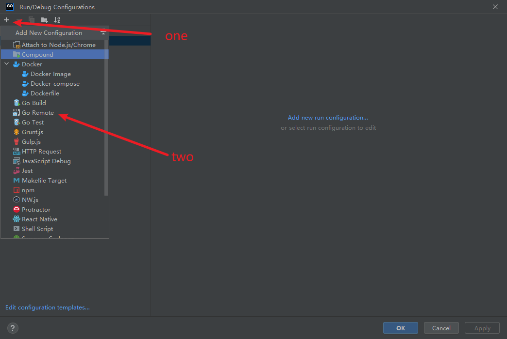
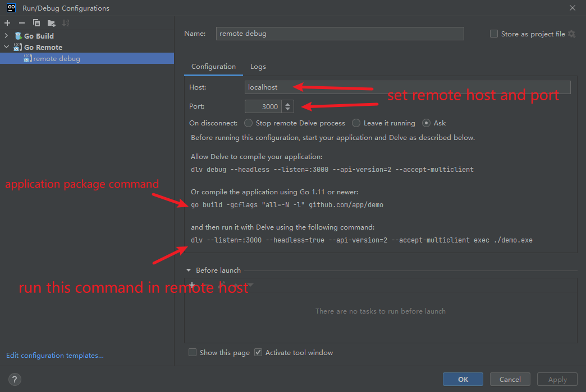
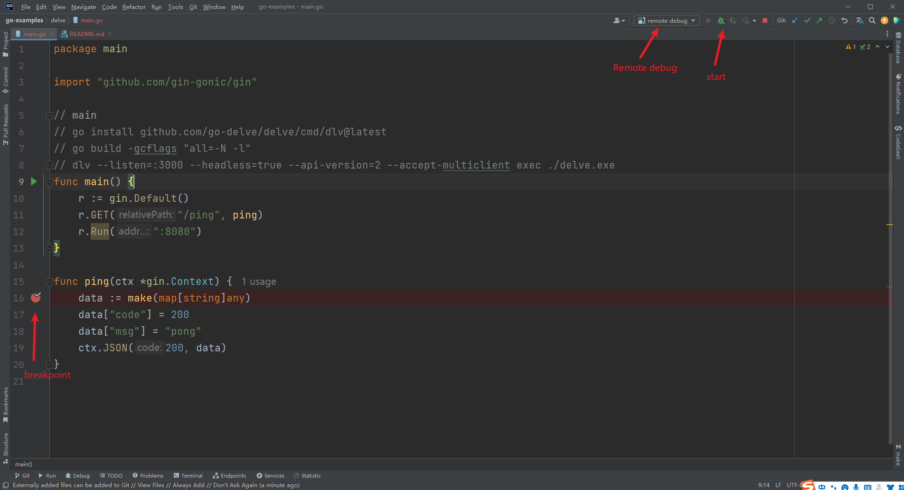

# Goland Remote Debug
This example shows how to debug a Go application running on a remote machine.

## Install Dependencies
```shell
go install github.com/go-delve/delve/cmd/dlv@latest
go get github.com/gin-gonic/gin
```

## Coding
```go
package main

import "github.com/gin-gonic/gin"

// main
// go install github.com/go-delve/delve/cmd/dlv@latest
// go build -gcflags "all=-N -l"
// dlv --listen=:3000 --headless=true --api-version=2 --accept-multiclient exec ./delve.exe
func main() {
	r := gin.Default()
	r.GET("/ping", ping)
	r.Run(":8080")
}

func ping(ctx *gin.Context) {
	data := make(map[string]any)
	data["code"] = 200
	data["msg"] = "pong"
	ctx.JSON(200, data)
}
```

## Compile Application
Need to `-gcflags "all=-N -l"` arg to compile application
```shell
go build -gcflags "all=-N -l"
```

##  Debug Application



Using blow command to start app.
```shell
dlv --listen=:3000 --headless=true --api-version=2 --accept-multiclient exec ./delve.exe
```
Then set breakpoint in Goland and start 


the breakpoint has paused when accessing blow url
```shell
http://127.0.0.1:8080/ping
```

## Reference
1. https://github.com/go-delve/delve/tree/master/Documentation/installation