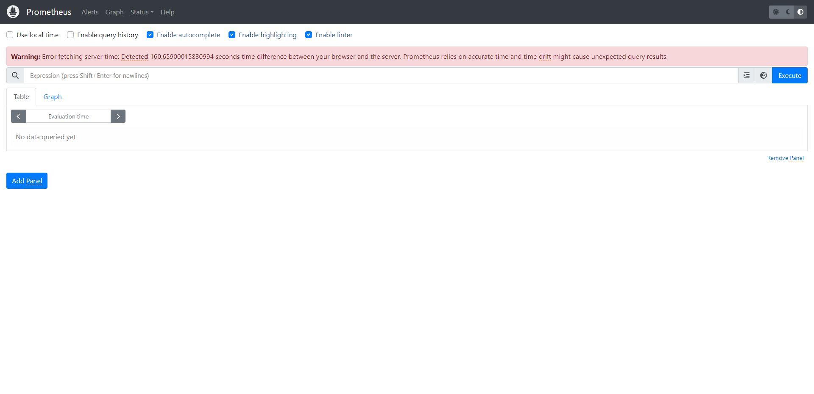
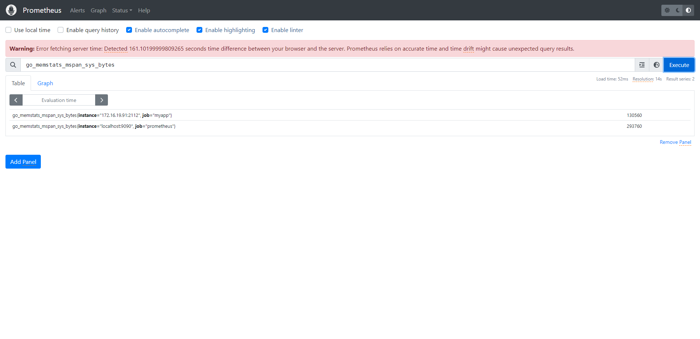

## Install prometheus with docker-compose

```yml
version: '3'

services:

  prometheus:
    image: prom/prometheus
    container_name: prometheus
    volumes:
      - ./prometheus/:/etc/prometheus/
      - prometheus_data:/prometheus
    command:
      - '--config.file=/etc/prometheus/prometheus.yml'
      - '--storage.tsdb.path=/prometheus'
      - '--web.console.libraries=/usr/share/prometheus/console_libraries'
      - '--web.console.templates=/usr/share/prometheus/consoles'
    ports:
      - "9090:9090"
    restart: always

volumes:
  prometheus_data:
```

User blow command to run prometheus container.

```shell
docker-compose up -d
```

When container start successfully, input http://127.0.0.1:9090  in borrower to access prometheus website.


## Coding

Install golang dependencies with blow commands

```shell
go get github.com/prometheus/client_golang/prometheus
go get github.com/prometheus/client_golang/prometheus/promauto
go get github.com/prometheus/client_golang/prometheus/promhttp
```

Create `main.go` file and paste blow code to it, then use `go run main.go` to start application

1. recordMetrics function to record myself metrics
2. access http://127.0.0.1:2112 to view all application's metrics

```golang
package main

import (
	"github.com/prometheus/client_golang/prometheus"
	"github.com/prometheus/client_golang/prometheus/promauto"
	"github.com/prometheus/client_golang/prometheus/promhttp"
	"net/http"
	"time"
)

func recordMetrics() {
	go func() {
		for {
			opsProcessed.Inc()
			time.Sleep(2 * time.Second)
		}
	}()
}

var (
	opsProcessed = promauto.NewCounter(prometheus.CounterOpts{
		Name: "myapp_processed_ops_total",
		Help: "The total number of processed events",
	})
)

func main() {
	recordMetrics()
	http.Handle("/metrics", promhttp.Handler())
	err := http.ListenAndServe(":2112", nil)
	if err != nil {
		panic(err)
	}
}
```

If you want to push application's metrics to prometheus instance. Add blow configuration to prometheus.yml and restart
prometheus instance.
Such as whole prometheus.yml that stored prometheus dict.

```yml
scrape_configs:
  - job_name: myapp
    scrape_interval: 10s
    static_configs:
      - targets:
          - localhost:2112
```



## Reference

1. [prometheus](https://prometheus.io/)
2. [prometheus go-application](https://prometheus.io/docs/guides/go-application/)
3. [collecting-prometheus-metrics-in-golang](https://gabrieltanner.org/blog/collecting-prometheus-metrics-in-golang/)
4. [how-to-set-up-docker-compose-for-prometheus-grafana](https://hackernoon.com/how-to-set-up-docker-compose-for-prometheus-grafana)
5. [docker-compose prometheus](https://github.com/ninadingole/docker-compose-stacks/tree/master/prometheus-grafana)